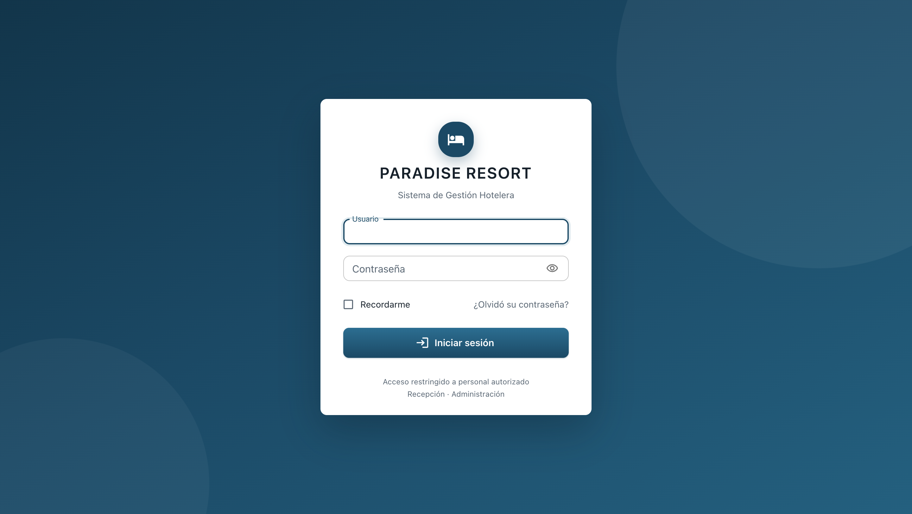
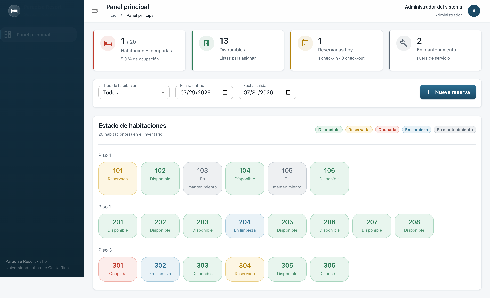
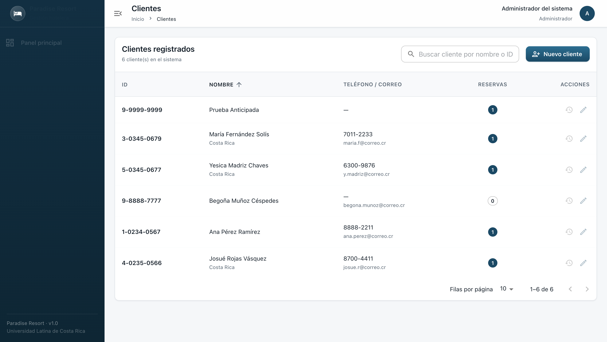
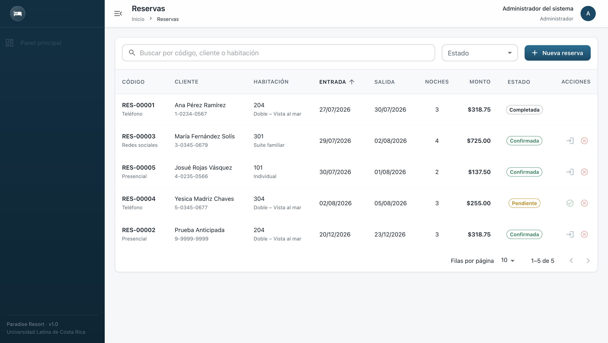
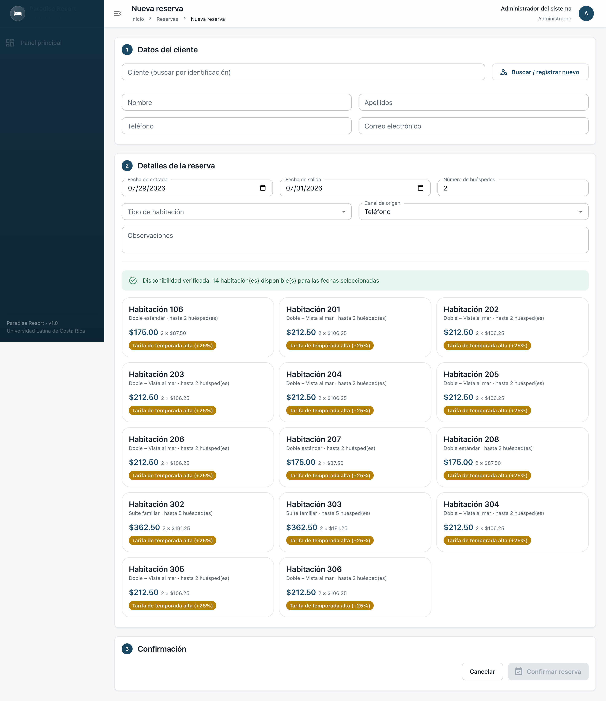
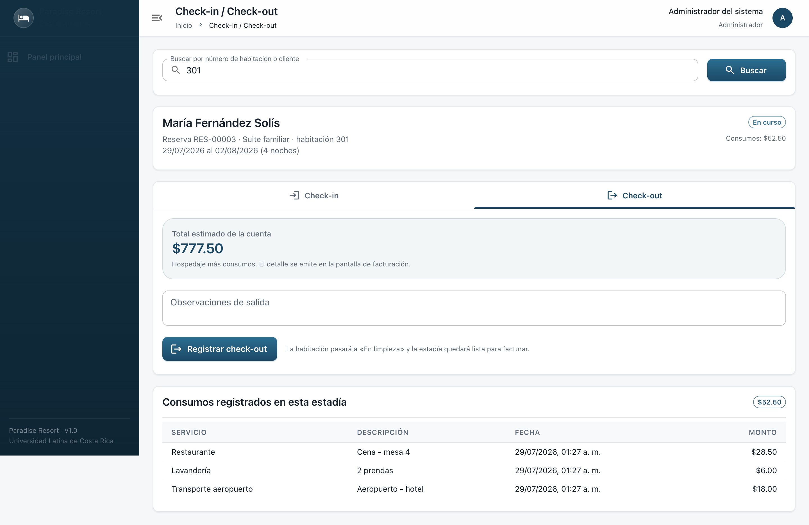
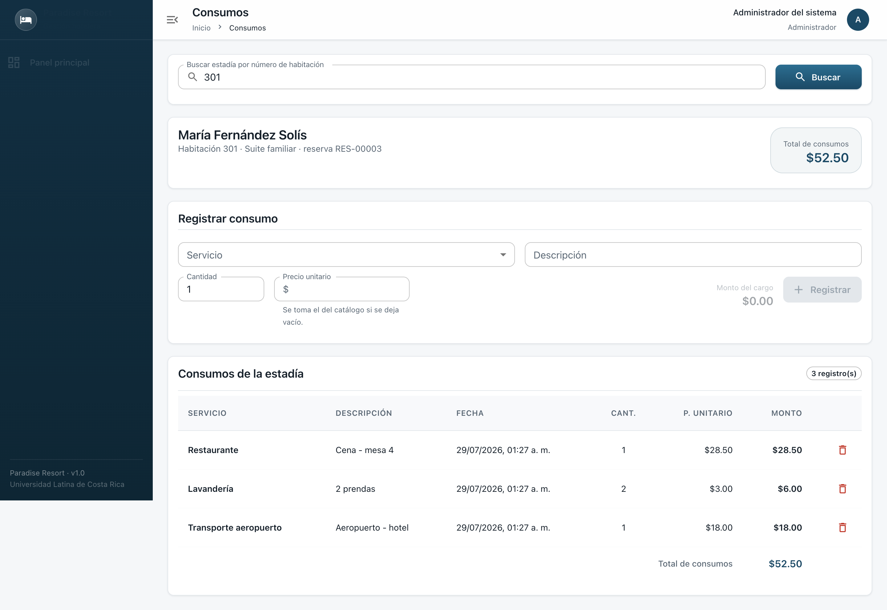
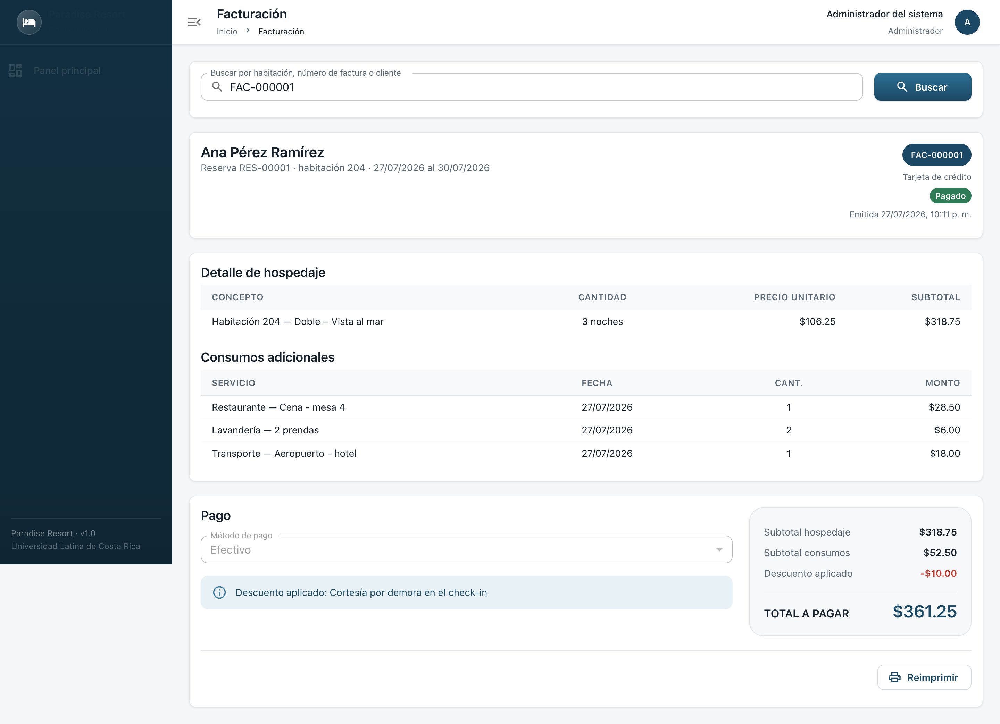
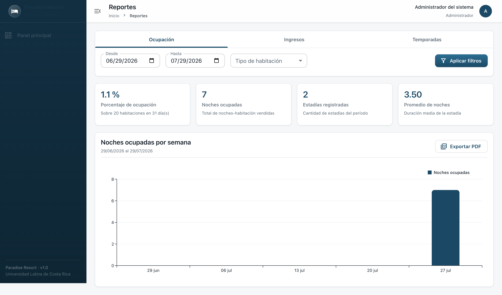

<div align="center" markdown="1">

# Manual de Usuario

## Sistema de Gestión Hotelera — Paradise Resort

**Versión 1.0**

Guía para el personal de recepción y administración

Universidad Latina de Costa Rica
Ingeniería en Sistemas Computacionales
Análisis y Diseño de Sistemas II

**Fecha:** julio de 2026

</div>

---

## Índice

1. [Introducción](#1-introducción)
2. [Inicio de sesión](#2-inicio-de-sesión)
3. [Cómo moverse por el sistema](#3-cómo-moverse-por-el-sistema)
4. [Panel principal](#4-panel-principal)
5. [Clientes](#5-clientes)
6. [Reservas](#6-reservas)
7. [Check-in](#7-check-in)
8. [Consumos](#8-consumos)
9. [Check-out](#9-check-out)
10. [Facturación](#10-facturación)
11. [Reportes](#11-reportes)
12. [Preguntas frecuentes](#12-preguntas-frecuentes)
13. [Mensajes y errores comunes](#13-mensajes-y-errores-comunes)
14. [Conclusiones](#14-conclusiones)

---

## 1. Introducción

### ¿Qué es este sistema?

Es la herramienta con la que Paradise Resort administra su operación diaria: los huéspedes, las
habitaciones, las reservas, los consumos de servicios y las facturas. Sustituye a las hojas de
cálculo y los cuadernos de recepción.

### ¿Qué gana usted al usarlo?

- **Nunca más dos reservas sobre la misma habitación.** El sistema lo impide.
- **Sabe al instante qué habitaciones hay libres**, sin consultar a nadie.
- **Ningún consumo se pierde.** Lo que registra durante la estadía aparece solo en la factura.
- **La factura se arma sola.** Usted revisa y emite.

### ¿Qué necesita?

Un computador con navegador web (Chrome, Edge, Firefox o Safari) y su usuario y contraseña. No
hay que instalar nada.

### Dos tipos de usuario

| Usuario | Qué puede hacer |
|---|---|
| **Recepcionista** | Atender huéspedes: clientes, reservas, check-in, check-out, consumos y facturación |
| **Administrador** | Todo lo anterior, y además consultar reportes y administrar las cuentas del personal |

Si intenta entrar a una sección que no le corresponde, el sistema se lo indicará. No es un error
suyo: es una medida de seguridad.

---

## 2. Inicio de sesión



### Pasos

1. Abra el navegador y escriba la dirección del sistema.
2. Escriba su **usuario** y su **contraseña**.
3. Pulse **Iniciar sesión**.

### Opciones de la pantalla

- **Recordarme** — guarda su nombre de usuario para la próxima vez. *Por seguridad, la contraseña
  nunca se guarda.*
- **¿Olvidó su contraseña?** — el administrador del sistema puede restablecerla.
- **Mostrar contraseña** (el ojo del campo) — para comprobar lo que escribió antes de entrar.

> **Si el sistema dice «Usuario o contraseña incorrectos»**, revise mayúsculas y minúsculas: la
> contraseña las distingue. Tras varios intentos, contacte al administrador.

### Cerrar sesión

Pulse su inicial en la esquina superior derecha y luego **Cerrar sesión**. Hágalo siempre al
terminar su turno, sobre todo en un computador compartido.

---

## 3. Cómo moverse por el sistema

Todas las pantallas comparten la misma estructura, de modo que no tiene que reaprender nada al
cambiar de sección.

| Zona | Para qué sirve |
|---|---|
| **Menú lateral** (izquierda, oscuro) | Cambiar de sección. La sección actual queda resaltada |
| **Barra superior** | Muestra dónde está y quién ha iniciado sesión |
| **Migas de pan** | La línea «Inicio › Reservas» indica su ubicación; puede pulsar para retroceder |
| **Área central** | El contenido de la sección |

El botón junto al título de la barra superior **contrae el menú** para ganar espacio. Al
contraerse, los iconos siguen visibles y al posar el cursor sobre ellos aparece su nombre.

### Mensajes del sistema

Tras cada acción aparece un aviso en la parte inferior:

| Color | Significado |
|---|---|
| **Verde** | La operación se completó |
| **Rojo** | Algo impidió completarla; el mensaje explica qué |
| **Amarillo** | Advertencia: revise algo antes de continuar |
| **Azul** | Información |

---

## 4. Panel principal

Es la pantalla de inicio y da la fotografía del hotel en este momento.



### Las cuatro tarjetas superiores

| Tarjeta | Qué indica |
|---|---|
| **Habitaciones ocupadas** | Cuántas tienen huésped, sobre el total, y el porcentaje de ocupación |
| **Disponibles** | Listas para asignar ahora mismo |
| **Reservadas hoy** | Llegadas previstas para el día, con los check-in y check-out ya realizados |
| **En mantenimiento** | Fuera de servicio |

### El mapa de habitaciones

Debajo aparece cada habitación agrupada por piso y con un color según su estado:

| Color | Estado | Significa |
|---|---|---|
| 🟩 Verde | Disponible | Libre, lista para asignar |
| 🟨 Amarillo | Reservada | Comprometida por una reserva |
| 🟥 Rojo | Ocupada | Con huésped hospedado |
| 🟦 Azul | En limpieza | Se está preparando |
| ⬜ Gris | En mantenimiento | Fuera de servicio |

**Pulse cualquier habitación** para ir directamente a su check-in o check-out.

### Filtros y acceso rápido

Puede filtrar por tipo de habitación y por fechas. El botón **+ Nueva reserva** lleva al
formulario de reserva conservando las fechas que haya elegido.

---

## 5. Clientes



### Buscar un huésped

Escriba en el buscador el nombre o el número de identificación. **No hace falta escribir los
acentos ni la ñ**: buscar «Perez» encuentra a «Pérez», y «munoz» encuentra a «Muñoz».

### Registrar un cliente nuevo

1. Pulse **Nuevo cliente**.
2. Complete identificación, nombre y apellidos (obligatorios).
3. Añada teléfono, correo y nacionalidad si los tiene.
4. Pulse **Registrar cliente**.

> No es necesario registrar al cliente antes de reservar: puede hacerlo en el mismo formulario de
> reserva.

### Editar y consultar historial

- El icono del **lápiz** permite corregir los datos. La identificación no se puede cambiar.
- El icono del **reloj** muestra el historial: qué se modificó, quién lo hizo y cuándo.

### Ordenar la tabla

Pulse sobre los títulos **ID** o **Nombre** para ordenar. Pulsando otra vez invierte el orden.

---

## 6. Reservas

### Ver las reservas



La tabla muestra código, huésped, habitación, fechas, noches, monto y estado. Puede buscar,
filtrar por estado y ordenar por las columnas con flecha.

### Los cuatro estados de una reserva

| Estado | Significado | Qué puede hacer |
|---|---|---|
| **Pendiente** | Registrada, sin confirmar | Confirmarla o cancelarla |
| **Confirmada** | En firme | Registrar el check-in o cancelarla |
| **Cancelada** | Anulada; la habitación quedó libre | Solo consultar |
| **Completada** | El huésped ya se fue | Solo consultar |

### Acciones rápidas

Al posar el cursor sobre una fila aparecen los iconos disponibles:

| Icono | Acción |
|---|---|
| ✓ | Confirmar la reserva |
| → | Registrar el check-in |
| ✕ | Cancelar la reserva |

### Crear una reserva



El formulario tiene tres pasos.

**1 · Datos del cliente**

Escriba la identificación y pulse **Buscar / registrar nuevo**:

- Si el cliente existe, sus datos se completan solos y aparece un aviso verde.
- Si no existe, complete nombre y apellidos: se registrará junto con la reserva.

**2 · Detalles de la reserva**

Indique fechas de entrada y salida, número de huéspedes, tipo de habitación y **canal de origen**
(por dónde llegó la solicitud: teléfono, correo, redes sociales o presencial).

En cuanto elija las fechas, el sistema **verifica la disponibilidad automáticamente** y muestra un
aviso:

- **Verde** — hay habitaciones disponibles, con su tarifa ya calculada.
- **Amarillo** — no hay disponibilidad para esas fechas. Pruebe otro rango u otro tipo.

Pulse la habitación que desee para seleccionarla; quedará marcada.

**3 · Confirmación**

Aparece la **tarifa preliminar**: noches, precio por noche y total. Revise con el huésped y pulse
**Confirmar reserva**.

> **Si la tarifa es más alta de lo habitual**, es temporada alta. El sistema aplica el recargo
> automáticamente en diciembre, enero, febrero y julio, y lo indica bajo el precio.

### Cancelar una reserva

Pulse el icono ✕ y **escriba el motivo** — es obligatorio y queda registrado para la auditoría del
hotel. Al confirmar, la habitación vuelve a quedar disponible.

> No se puede cancelar una reserva cuyo huésped ya hizo check-in.

---

## 7. Check-in

Es el registro de la llegada del huésped.



### Pasos

1. Entre a **Check-in / Check-out**.
2. Escriba el número de habitación o el nombre del huésped y pulse **Buscar**.
3. Compruebe los datos en la tarjeta superior, que permanece visible durante toda la operación.
4. En la pestaña **Check-in**, confirme el número de huéspedes y añada observaciones si las hay
   (por ejemplo, «solicita cuna adicional»).
5. Pulse **Registrar check-in**.

La habitación pasa automáticamente a **Ocupada**.

### Requisitos

| Condición | Por qué |
|---|---|
| La reserva debe estar **confirmada** | Una reserva pendiente aún no está en firme |
| La fecha debe estar dentro del período reservado | No se registra la llegada de una reserva de meses después |
| La habitación debe estar lista | Si está en limpieza o mantenimiento, el sistema lo advierte |

---

## 8. Consumos

Aquí se registran los servicios que el huésped consume: restaurante, lavandería, transporte y
actividades recreativas.



### Registrar un consumo

1. Busque la estadía por número de habitación.
2. Elija el **servicio** de la lista.
3. Escriba una **descripción** («Cena - mesa 4», «2 prendas», «Aeropuerto - hotel»).
4. Indique **cantidad** y **precio unitario**. El precio del catálogo se propone solo, y puede
   ajustarlo si el cargo real fue distinto.
5. Pulse **Registrar**.

El monto se calcula en pantalla mientras escribe, y el total de la estadía se actualiza al instante.

### Corregir un error

Si registró un cargo equivocado, pulse el icono de la papelera. El sistema pedirá confirmación.

> **Solo se pueden registrar o eliminar consumos mientras la estadía esté en curso.** Después del
> check-out la cuenta queda cerrada.

**Este es el paso que evita las pérdidas del hotel.** Todo lo que registre aquí aparecerá
automáticamente en la factura; lo que no registre, no se cobra.

---

## 9. Check-out

Es el cierre de la estadía cuando el huésped se va.

### Pasos

1. Entre a **Check-in / Check-out** y busque la habitación.
2. Vaya a la pestaña **Check-out**.
3. Revise el **total estimado de la cuenta**, que muestra hospedaje más consumos.
4. Añada observaciones de salida si corresponde.
5. Pulse **Registrar check-out** y confirme.

Al confirmar: la habitación pasa a **En limpieza**, la reserva queda **Completada** y la estadía
queda lista para facturar.

> Revise con el huésped los consumos **antes** de cerrar. Después del check-out ya no se pueden
> añadir cargos a esa cuenta.

---

## 10. Facturación



### Emitir una factura

1. Entre a **Facturación** y busque por número de habitación.
2. Revise el detalle: hospedaje (noches × precio) y consumos adicionales.
3. Elija el **método de pago**.
4. Si corresponde un descuento, escriba el monto y **su justificación** (obligatoria).
5. Marque si el pago se registra en el momento.
6. Pulse **Emitir factura** y confirme en el resumen que aparece.

### Los totales

| Línea | Qué es |
|---|---|
| Subtotal hospedaje | Noches × tarifa |
| Subtotal consumos | Suma de los servicios |
| Descuento aplicado | Si lo hubo, se resta |
| **TOTAL A PAGAR** | Lo que abona el huésped |

### Reimprimir una factura

Busque por **número de factura** (por ejemplo `FAC-000001`) o por el nombre del cliente y pulse
**Reimprimir**. Al imprimir, el menú y la barra superior se ocultan automáticamente: el papel sale
solo con el comprobante.

### Registrar un pago posterior

Si la factura quedó pendiente, búsquela y pulse **Registrar pago**.

> **Una estadía se factura una sola vez.** Si intenta facturarla de nuevo, el sistema lo impedirá.

---

## 11. Reportes

*Sección exclusiva del Administrador.*



### Los tres reportes

| Pestaña | Responde a |
|---|---|
| **Ocupación** | ¿Qué tan lleno estuvo el hotel? Porcentaje, noches vendidas, estadías y duración media |
| **Ingresos** | ¿Cuánto se facturó? Separa hospedaje de servicios adicionales |
| **Temporadas** | ¿Cuándo hay más demanda? Agrupa por mes e identifica el pico y el valle |

### Cómo consultarlos

1. Elija la pestaña.
2. Indique el período en **Desde** y **Hasta**.
3. Opcionalmente, filtre por tipo de habitación.
4. Pulse **Aplicar filtros**.

Aparecen las tarjetas con los indicadores y, debajo, un gráfico de la evolución del período. Cada
columna corresponde a una semana (o a un mes en Temporadas) y muestra la fecha en que comienza.

**Exportar PDF** abre el diálogo de impresión del navegador, donde puede guardar el reporte como
archivo.

---

## 12. Preguntas frecuentes

**¿Puedo reservar una habitación que hoy está ocupada?**
Sí, siempre que sea para fechas en las que quede libre. El sistema solo impide que dos reservas se
solapen.

**¿Por qué no aparece una habitación en la lista de disponibles?**
Porque ya tiene una reserva que se cruza con esas fechas, o porque está en mantenimiento.

**Registré mal un consumo. ¿Puedo borrarlo?**
Sí, mientras la estadía siga en curso. Pulse la papelera junto al cargo.

**¿Puedo cambiar las fechas de una reserva ya creada?**
Sí, mientras no se haya hecho el check-in. El sistema comprobará la disponibilidad de las fechas
nuevas.

**El huésped se va antes de lo previsto. ¿Se cobra menos?**
No automáticamente. El hospedaje se cobra por las noches contratadas en la reserva. Si corresponde
un ajuste, modifique la reserva antes del check-out o aplique un descuento justificado.

**¿Por qué la tarifa cambió respecto a lo que le dije al huésped?**
En temporada alta (diciembre, enero, febrero y julio) se aplica un recargo. El sistema lo indica
bajo el precio, junto a la habitación.

**¿Se puede anular una factura ya emitida?**
No desde la interfaz. Contacte al administrador del sistema.

**Cerré el navegador sin cerrar sesión. ¿Hay riesgo?**
Su sesión caduca sola, pero cierre sesión siempre en computadores compartidos.

---

## 13. Mensajes y errores comunes

| Mensaje | Qué ocurrió | Qué hacer |
|---|---|---|
| «La habitación no está disponible en las fechas seleccionadas» | Otra reserva se cruza con ese rango | Elija otra habitación u otras fechas |
| «No es posible registrar el check-in de una reserva en estado 'Pendiente'» | La reserva no está confirmada | Confírmela primero desde Reservas |
| «La reserva inicia el dd/mm/aaaa. No es posible registrar el check-in antes de esa fecha» | Se intentó registrar una llegada anticipada | Verifique que es la reserva correcta |
| «Debe registrarse el check-out antes de facturar la estadía» | La estadía sigue abierta | Haga primero el check-out |
| «La estadía ya fue facturada» | Ya existe un comprobante | Búsquelo por su número y reimprímalo |
| «Todo descuento debe indicar su justificación» | Se puso un descuento sin motivo | Escriba la razón del descuento |
| «La habitación admite un máximo de N huésped(es)» | Se excedió la capacidad | Elija una habitación mayor |
| «No cuenta con permisos para realizar esta operación» | La sección es de Administrador | Solicite el acceso al administrador |
| «Otro usuario modificó esta información mientras usted trabajaba» | Dos personas editaron a la vez | Actualice la pantalla y repita la operación |
| «Su sesión expiró» | Pasó demasiado tiempo inactivo | Vuelva a iniciar sesión |
| «No se pudo contactar con el servidor» | Problema de red o servicio detenido | Verifique su conexión; si persiste, avise a soporte |

---

## 14. Conclusiones

El sistema acompaña el recorrido completo del huésped en un flujo continuo:

```
Cliente → Reserva → Confirmación → Check-in → Consumos → Check-out → Factura
```

**Tres hábitos que conviene adoptar:**

1. **Registre los consumos en el momento.** Es lo que evita las pérdidas por servicios no cobrados.
2. **Confirme las reservas apenas queden en firme.** Sin confirmar, no se puede hacer el check-in.
3. **Revise la cuenta con el huésped antes del check-out.** Después ya no se pueden añadir cargos.

Si algo no funciona como espera, lea el mensaje que muestra el sistema: está escrito para
indicarle exactamente qué hacer. Si el problema persiste, contacte al administrador.

---

<div align="center" markdown="1">

*Manual de Usuario · Paradise Resort v1.0 · Universidad Latina de Costa Rica*

</div>
